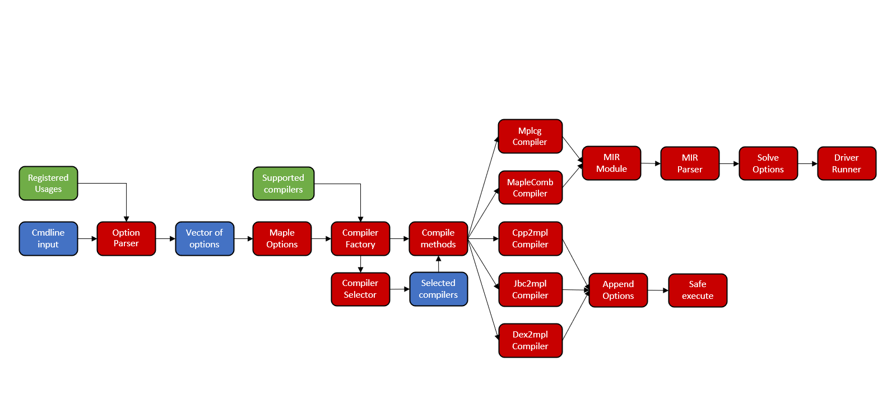

# 枫树驱动程序概述
## 简介
本文档描述了枫树驱动程序的当前状态。这包括设计、使用、目标和内部实施。

# 目标#
枫树驱动程序旨在满足Clang等良好编译器驱动程序的要求。换句话说，它应该是：
-灵活支持新功能
-高效，开销低
-易于使用

驱动程序开发的最终目标是完全支持gcc选项，并直接集成到CMake构建系统中。

## 设计和实现

### 设计概述

下图显示了枫树驱动程序体系结构的重要组件以及它们之间的关系。红色组件表示基本的驱动程序部分（类、方法），蓝色组件是输出/输入数据结构，绿色组件是重要的帮助器类。

### 驱动程序阶段

驱动程序功能可分为五个阶段：

**1.解析选项**

首先检查输入命令行参数字符串的格式正确性，并将其转换为键值对，然后检查键是否在`OptionParser`的`usage`多映射（以前从帮助数据结构创建）中匹配。`Option`类还包含`Descriptor`数据结构，描述了选项参数所需的解析详细信息，并提供了一些附加数据。然后解析参数。驱动程序希望了解所有可用选项。然后，结果将写入`OptionParser`类的`options`向量中。

**2.填充MplOptions**

解析输入后，根据结果填充`MplOptions`：首先，运行类型决定为自动或自定义（取决于`--run`选项的存在），然后初始化输入文件并检查有效性。如果运行类型为自动枫树驱动程序还将自行配置代码生成管道（您将接收汇编程序文件作为最终输出），具体取决于第一个输入文件的扩展名。然后处理其他选项，包括`--option`，其值必须包含编译所有阶段的选项，使用解析通用选项时使用的相同方法和数据结构解析值，结果将推送到`MplOptions`类的映射`exeOptions`中。然后，枫树驱动程序尝试打开输入文件，如果成功，将进入下一阶段。

**3.编译器选择**

上一阶段完成后，枫树驱动程序触发`CompilerFactory`类构造函数，该构造函数创建受支持编译器的类，并将指向所有编译器的指针保存在`supportedCompilers`数据结构中。

**4.阶段特定选项构建**

`CompilerFactory`调用选定编译器的`Compile`方法，在此期间，默认和用户确定的选项被构造并写入字符串中。主要的问题是命令从一种风格转换到另一种风格，一些驱动程序组件，如`MplcgCompiler`需要自己的方法才能正确工作，而另一些组件，就像`AsCompiler`一样，只使用几个选项，它们的主要目的是确定可执行文件的路径，以调用和传递它们的输入和输出参数。

但是，`MaplecombCompiler`和`MplcgCompiler`需要特殊的管道，它们不调用可执行文件并将命令行传递给它们，而是使用`MIRModule`与输入文件交互，'mirParser'和'DriverRunner'类。`MIRModule`是一种数据结构，其目的类似于`MplOptions`，前面提到的两个编译器在其中存储关键数据（输入文件的名称、源语言等）；顾名思义，`MIRParser`存在于解析枫树IR; `DriverRunner`是一个协调器，它可以与以前的两个数据结构一起工作，还存储它负责的阶段的选项和编译中所需的其他数据。

**5.执行**

之后，可执行文件的命令行和完整路径将重定向到`SafeExe`类的`Exe`方法，在那里它通过子进程处理和执行。如果是`MaplecombCompiler`和`MplcgCompiler`，则调用`DriverRunner`的`Run`方法，并将作业发布到阶段管理器。