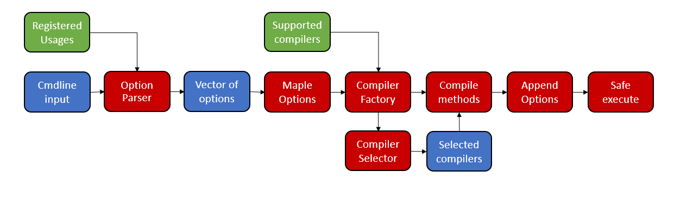

# Maple Driver Overview
## Introduction
This document describes current state of Maple Driver. This includes design, usage, goals and internal implementation.

##  Goals
The Maple driver is intended to meet requirements of a good compiler driver such as Clang. In other words it should be:
- Flexible to support new features
- Efficient with low overhead
- Easy to use

The end goal of driver development is full support of gcc options with direct integration into the CMake build system.

## Design and Implementation

### Design overview

The diagram below shows significant components of the Maple Driver architecture as well as their realtions to one another. The red components represent essential driver parts(classes, methods), the blue components are output/input data structures, the green components are important helper classes.

### Driver stages

The driver functionality can be divded into "insert number" stages:

**1. Parsing options**

The input command-line argument strings are firstly checked for correctness of format and transformed into pairs of key-value, keys are then checked for a match in `usages` multimap (previously created from a helper data structure) of `OptionParser`. The `Option` class also contains `Descriptor` data structure, describing required parsing details for option argument with some additional data. Then the argument is parsed. The driver expects to understand all available options. The result is then written in the `options` vector of the `OptionParser` class.

**2. Filling MplOptions**

After parsing input, `MplOptions` is filled depending on the results: firstly the run type is decided to be either automatic or custom (depends on the presence of `--run` option), then input files are initialized and checked for validity. If the run type is automatic Maple Driver will also configure the code generation pipeline by itself(you will recieve assembler file as the final output), depending on the extension of the first input file. Then other options are handled, including `--option`, value of which must contain options for all phases of compilation, the value is parsed using the same methods and data structures that were used in parsing of general options, the results are pushed in map `exeOptions` of the `MplOptions` class. Then the Maple Driver attempts to open input file and in case of success moves on to the next stage.

**3. Compiler Selection**

Upon the completion of the previous stage Maple Driver triggers `CompilerFactory` class constructor, which creates classes of supported compilers and saves pointers to all of them in `supportedCompilers` data structure. 

**4. Phase specific option construction**

`CompilerFactory` calls `Compile` methods of selected Compilers, during which default and user-determined options are constructed and written in a string. The main problem is the translation of commands from one style to another, some driver components, like `MplcgCompiler` require their own methods to work correctly, while others, like `AsCompiler` work with just a handful of options and their main purpose is to determine the path of the executable to call and pass on their input and output arguments.

**5. Execute**

After that the command-line and full path to executable is redirected to the `Exe` method of the `SafeExe` class, where it is handled and executed via child process.

