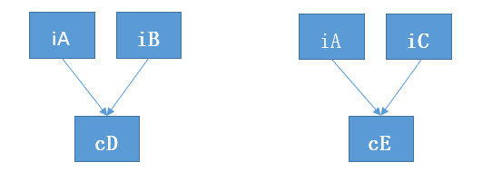

#方舟编译器vtable和itable设计介绍

## 虚函数表

方舟编译器会为每一个类生成一个虚方法表。在这个表中，会存储父类的虚方法，再加上子类的虚方法以及实现的接口类的Default方法。如果子类重载了父类的实现，那么在虚方法表中同样的位置，则会覆盖掉父类的方法。

下面，展示一个具体 的例子：


方舟编译器生成的虚函数表的结构如下：


   A:
```
 _vtb_LA_3B:
        .quad   Ljava_2Flang_2FObject_3B_7Cclone_7C_28_29Ljava_2Flang_2FObject_3B - .
        .quad   Ljava_2Flang_2FObject_3B_7Cequals_7C_28Ljava_2Flang_2FObject_3B_29Z - .
        .quad   Ljava_2Flang_2FObject_3B_7Cfinalize_7C_28_29V - .
        .quad   Ljava_2Flang_2FObject_3B_7CgetClass_7C_28_29Ljava_2Flang_2FClass_3B - .
        .quad   Ljava_2Flang_2FObject_3B_7ChashCode_7C_28_29I - .
        .quad   Ljava_2Flang_2FObject_3B_7Cnotify_7C_28_29V - .
        .quad   Ljava_2Flang_2FObject_3B_7CnotifyAll_7C_28_29V - .
        .quad   Ljava_2Flang_2FObject_3B_7CtoString_7C_28_29Ljava_2Flang_2FString_3B - .
        .quad   Ljava_2Flang_2FObject_3B_7Cwait_7C_28_29V - .
        .quad   Ljava_2Flang_2FObject_3B_7Cwait_7C_28J_29V - .
        .quad   Ljava_2Flang_2FObject_3B_7Cwait_7C_28JI_29V - .
        .quad   LA_3B_7Cfirst_7C_28_29I - .
```

B:

```
 __vtb_LB_3B:
        .quad   Ljava_2Flang_2FObject_3B_7Cclone_7C_28_29Ljava_2Flang_2FObject_3B - .
        .quad   Ljava_2Flang_2FObject_3B_7Cequals_7C_28Ljava_2Flang_2FObject_3B_29Z - .
        .quad   Ljava_2Flang_2FObject_3B_7Cfinalize_7C_28_29V - .
        .quad   Ljava_2Flang_2FObject_3B_7CgetClass_7C_28_29Ljava_2Flang_2FClass_3B - .
        .quad   Ljava_2Flang_2FObject_3B_7ChashCode_7C_28_29I - .
        .quad   Ljava_2Flang_2FObject_3B_7Cnotify_7C_28_29V - .
        .quad   Ljava_2Flang_2FObject_3B_7CnotifyAll_7C_28_29V - .
        .quad   Ljava_2Flang_2FObject_3B_7CtoString_7C_28_29Ljava_2Flang_2FString_3B - .
        .quad   Ljava_2Flang_2FObject_3B_7Cwait_7C_28_29V - .
        .quad   Ljava_2Flang_2FObject_3B_7Cwait_7C_28J_29V - .
        .quad   Ljava_2Flang_2FObject_3B_7Cwait_7C_28JI_29V - .
        .quad   LB_3B_7Cfirst_7C_28_29I - .
        .quad   LB_3B_7Cfoo_7C_28_29V - .
```
C：
```
__vtb_LC_3B:
前面11个和A和B一样
       … …
       .quad   LC_3B_7Cfirst_7C_28_29I - .
       .quad   LC_3B_7Cbar_7C_28_29V - .

```

对比一下，我们可以发现：
1. 所有的类都是继承自Object类，所以虚函数表的前面11个函数都是继承自Object，且和父类Object布局保持一致。
2. 对于第12个函数，子类B覆盖了父类A，所以在同样的位置，父类是LA_3B_7Cfirst_7C_28_29I，子类是LB_3B_7Cfirst_7C_28_29I。

## 虚函数访问

因为要保持多态性，所以在编译时，不能确定具体调用是哪个函数。下面具体例子：


像这种情况，我们编译时不能知道运行时调用的是B里面的first函数，还是C里面的first函数。

但是，因为first函数在A，B,C中布局一致，我们可以知道first函数在vtab中的偏移是12，所以，我们可以生成这样的访问代码，从相应的对象中拿到vtable指针，然后加上offset12即可访问到函数。

在程序执行过程中(图1D)，当遇到虚拟函数调用的时候，
1. 判断对象(this_指针)是哪个类的实例(在图1D中，this是类C的实例)；
2. 使用函数索引在对应类的虚拟函数表中查找；
3. 返回实际调用的函数指针。


<center>图1: Java虚拟函数调用的静态化</center>

## 接口函数表

Interface call类似于多重继承，比java单继承要复杂。多继承无法天然地确定唯一一个继承顺序。

在一个封闭的环境下，可以通过拓扑排序的方法确定一个顺序(iA，iB，iC)。好处是可以实现像虚函数表一样的访问方式来处理interface call。但是这样得到的一个类的itable会非常大，而且大部分是空洞。考虑到性能和代码大小，这种方法是不可用的。



对于开放的环境，编译时刻是无法通过拓扑排序来确定一个顺序的，导致接口函数表里的方法顺序不固定，所以实际实现中没办法像虚函数调用一样实现一个顺序一致的方法表和访问形式为offset的访问机制。在编译时刻，可以确定一个类实现的所有接口，以及接口的继承关系。运行时对函数名字和签名进行比较来确定需要调用的函数。因为字符串比较开销比较大，所以方舟编译器会在编译时刻对函数名字和签名进行哈希计算得出哈希值。运行时首先比较哈希值；如果哈希值相同，且不存在哈希冲突，则调用这个函数。如果存在哈希冲突，则进行函数名字和签名的比较，取得函数指针。

接口函数表的结构如下：

| 不冲突的接口函数表的size                         |
|--------------------------------------------------|
| 1 （对齐作用）                                   |
| Func1的basename的hash number                     |
| Fun1的地址                                       |
| Func2的basename的hash number                     |
| Func2的地址                                      |
| ......                                           |
| Func3的basename和Func4的basename的hash number,   |
| 1（表示冲突），因为func3和func4的hash number一样 |
| ……                                               |
| Func3的signature                                 |
| Func3的地址                                      |
| Func4的signature                                 |
| Func4的地址                                      |
| ……                                               |

## 接口函数调用：


<center>图2：Java接口函数调用的静态化</center>


在程序执行过程中，
1. 判断对象(obj)是哪个类的实例(图2中，obj是类A的实例)；
2. 调用函数getFuncPtrFromItab，根据函数签名的哈希值在对应类的哈希表中查找，如果找到就返回函数指针，否则在冲突消除表中用函数签名查找；
3. 返回实际调用的函数指针；
4. 间接调用函数指针，并把相关的参数(args)传给间接调用。

下面，举一个具体的例子：

这个IsEmpty类实现了接口A和B，每个接口中声明有两个方法。


这是IsEmpty对应的itable。


我们可以看到第一个选项为4，表示有4个不冲突的方法，第二个选项1是对齐作用。后面4项分别为函数签名产生的hash值和对应的函数地址。由于这个例子没有hash冲突，所以后面没有hash冲突的表项。

我们可以看到源码中test函数中会产生一个interface-call，那产生的maple代码如下。


GetFuncPtrFromItab函数有三个参数，classinfo，函数basename对应的hash值，和函数的签名。这个调用过程是先通过classinfo找到itab表，然后进行进行hash值的比对，如果比对成功且不冲突则读出地址来。如果比对冲突了。则再用signature name进行比对。

##  Interface override

Java 8中引入了`Default`函数。父类中的实现会覆盖接口中的Default函数；接口之间的Default函数需要根据接口的继承关系来确定Override。如图3所示，类cA继承类cB实现了接口iD，在cB和iD中都有foo的实现。对于cA来说，foo的实现来自父类cB而不是接口iD。


<center>图3：父类定义的函数覆盖接口定义的函数</center>

如图4所示，接口Parent和Son都定义了getValue。对于类Sson来说，getValue的实现来自Son，而不是来自Parent。


<center>图4：子接口定义的函数覆盖父接口定义的函数</center>
